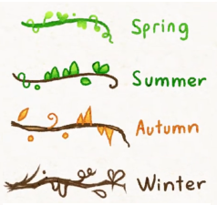

# Tendril

Tendril is a library dedicated to draw [Tendrilis](https://www.omniglot.com/conscripts/tendrilis.htm).
It's a lightweight vector graphics library implemented in C++.
It only contains the necessary features to draw Tendrilises.

While full-fledged vector graphics libraries exist, this one should be easy to study or hack on.

## Demo

An online demo is available [here](https://kevreco.github.io/tendril/).

## Gallery


## Features

- Vector path with lines, polylines, curves and elliptic arcs.
- Path filling and path stroking with anti-aliasing.
- Path transformation.
- Text to path conversion using .ttf font.
- Export path to .svg file.

## TODO

- Prevent Dear ImGui to render 60 frame per second and only redraw the screen when necessary.
- Use a font with smaller footprint (the current one is above 700 KB).
- Strip non-used icons from the icon font to further reduce the memory footprint.
- Find a way to draw the 4 extra flavor of Tendrilis:



## Build

### Windows

```
git clone https://github.com/kevreco/tendril.git
cd tendril
cl.exe cb.c
cb.exe
```

### Unix

While the Tendril library itself is self contained, the Unix system needs GLFW to build the demo.
The Tendril library should be straightforward to build embeded and build using the `src/tendril/build.cpp` file.

```
git clone https://github.com/kevreco/tendril.git
cd tendril
cc ./cb.c -o cb.bin
./cb.bin
```
