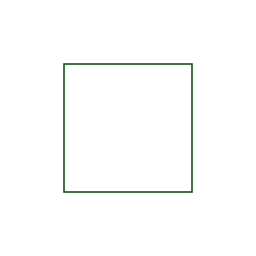
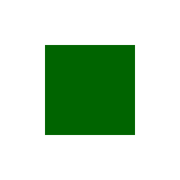
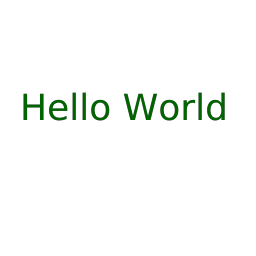
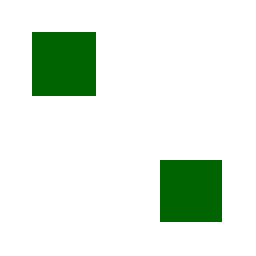
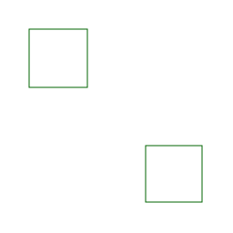

# Examples

## Stroke

Stroke path.

## Fill

Fill path.

## Text

Stroke text based on font.

## Tendrilis

Stroke Tendrilis based on font.

## Export SVG

The first svg has been exported using absolute values while the second was exported using relative values.

