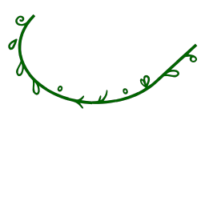

# Examples

## Stroke

Stroke path.

[See source code](https://github.com/kevreco/tendril/tree/master/src/examples/01_stroke.cpp)

## Fill

Fill path.

[See source code](https://github.com/kevreco/tendril/tree/master/src/examples/02_fill.cpp)

## Text

Stroke text based on font.

[See source code](https://github.com/kevreco/tendril/tree/master/src/examples/03_text.cpp)

## Tendrilis

Stroke Tendrilis based on font.

[See source code](https://github.com/kevreco/tendril/tree/master/src/examples/04_tendrilis.cpp)

## SVG Export

The first svg has been exported using absolute values while the second was exported using relative values.

[See source code](https://github.com/kevreco/tendril/tree/master/src/examples/05_svg_export.cpp)

## SVG Import

Import the `g` component of a .svg file.

[See source code](https://github.com/kevreco/tendril/tree/master/src/examples/06_svg_path_import.cpp)

